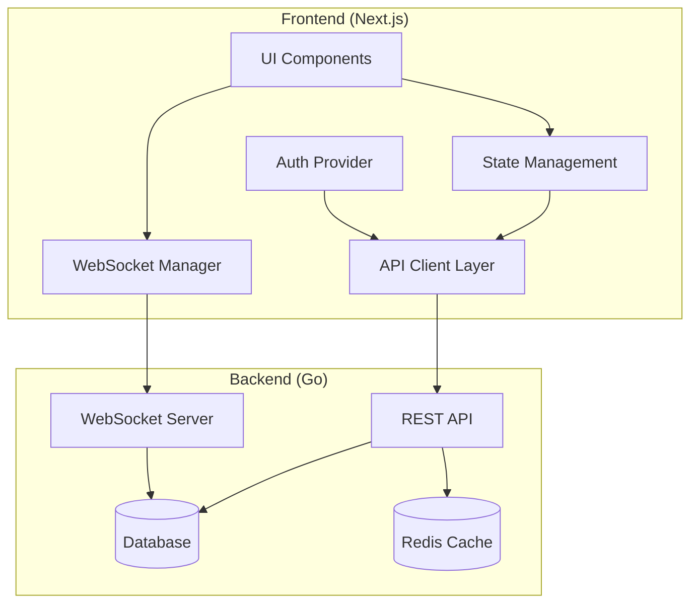

# Frontend-Backend Integration Design

## Overview

This design document outlines the architecture for integrating the Next.js frontend with the Go backend API. The integration will provide a seamless user experience with real-time features, robust authentication, and comprehensive website management capabilities.

The design follows modern React patterns with TypeScript, leverages Next.js 15 features, and implements a clean separation of concerns between API communication, state management, and UI components.

## Architecture

### High-Level Architecture



### Component Architecture

The frontend will be organized into the following layers:

1. **Presentation Layer**: React components and pages
2. **Business Logic Layer**: Custom hooks and services
3. **Data Access Layer**: API client and WebSocket manager
4. **State Management Layer**: Context providers and local state
5. **Authentication Layer**: Auth context and token management

## Components and Interfaces

### 1. API Client Layer

#### APIClient Interface
```typescript
interface APIClient {
  // Authentication
  auth: {
    login(credentials: LoginCredentials): Promise<AuthResponse>
    register(userData: RegisterData): Promise<AuthResponse>
    logout(): Promise<void>
    refreshToken(): Promise<AuthResponse>
    getProfile(): Promise<User>
    updateProfile(data: UpdateProfileData): Promise<User>
  }
  
  // Website Management
  websites: {
    list(params?: ListParams): Promise<PaginatedResponse<Website>>
    create(data: CreateWebsiteData): Promise<Website>
    get(id: string): Promise<Website>
    update(id: string, data: UpdateWebsiteData): Promise<Website>
    delete(id: string): Promise<void>
    getAnalytics(id: string, params?: AnalyticsParams): Promise<Analytics>
  }
  
  // Chat Management
  chat: {
    getSessions(websiteId: string): Promise<ChatSession[]>
    getMessages(sessionId: string): Promise<Message[]>
    sendMessage(sessionId: string, message: string): Promise<Message>
  }
  
  // Widget Configuration
  widgets: {
    getConfig(websiteId: string): Promise<WidgetConfig>
    updateConfig(websiteId: string, config: WidgetConfig): Promise<WidgetConfig>
    generateScript(websiteId: string): Promise<string>
  }
  
  // Analytics
  analytics: {
    getDashboard(params?: DashboardParams): Promise<DashboardData>
    getWebsiteMetrics(websiteId: string, params?: MetricsParams): Promise<WebsiteMetrics>
  }
}
```

#### HTTP Client Implementation
- Built on top of fetch API with TypeScript
- Automatic token attachment and refresh
- Request/response interceptors for error handling
- Retry logic for failed requests
- Request deduplication for concurrent identical requests

### 2. WebSocket Manager

#### WebSocketManager Interface
```typescript
interface WebSocketManager {
  connect(websiteId: string): Promise<void>
  disconnect(): void
  sendMessage(message: ChatMessage): void
  onMessage(callback: (message: ChatMessage) => void): void
  onTyping(callback: (data: TypingData) => void): void
  onConnectionChange(callback: (connected: boolean) => void): void
  getConnectionStatus(): ConnectionStatus
}
```

#### Features
- Automatic reconnection with exponential backoff
- Message queuing during disconnection
- Heartbeat mechanism for connection health
- Room-based message routing
- Typing indicators and presence management

### 3. Authentication System

#### AuthContext Provider
```typescript
interface AuthContextType {
  user: User | null
  isAuthenticated: boolean
  isLoading: boolean
  login(credentials: LoginCredentials): Promise<void>
  register(userData: RegisterData): Promise<void>
  logout(): Promise<void>
  updateProfile(data: UpdateProfileData): Promise<void>
}
```

#### Token Management
- JWT token storage in httpOnly cookies (when possible) or localStorage
- Automatic token refresh before expiration
- Token validation and cleanup
- Secure token transmission

### 4. State Management

#### Global State Structure
```typescript
interface AppState {
  auth: AuthState
  websites: WebsitesState
  chat: ChatState
  analytics: AnalyticsState
  ui: UIState
}

interface WebsitesState {
  items: Website[]
  loading: boolean
  error: string | null
  pagination: PaginationInfo
  selectedWebsite: Website | null
}

interface ChatState {
  sessions: Record<string, ChatSession>
  messages: Record<string, Message[]>
  activeSession: string | null
  typing: Record<string, boolean>
  connected: boolean
}
```

#### State Management Strategy
- React Context for global state (auth, theme)
- Custom hooks for component-level state
- SWR/React Query for server state management
- Local storage for persistence where appropriate

### 5. UI Components

#### Component Hierarchy
```
App
├── AuthProvider
├── ThemeProvider
├── Layout
│   ├── Sidebar
│   ├── Header
│   └── Main Content
│       ├── Dashboard
│       ├── Sites Management
│       ├── Chat Interface
│       ├── Analytics
│       └── Settings
```

#### Key Components
- **AuthGuard**: Protects routes requiring authentication
- **WebsiteCard**: Displays website information with actions
- **ChatWidget**: Real-time chat interface
- **AnalyticsDashboard**: Charts and metrics display
- **WidgetConfigurator**: Visual widget customization
- **DataTable**: Reusable table with sorting/filtering

## Data Models

### Core Data Types

```typescript
interface User {
  id: string
  email: string
  name: string
  createdAt: string
  updatedAt: string
}

interface Website {
  id: string
  name: string
  domain: string
  widgetKey: string
  settings: WidgetConfig
  analytics: WebsiteAnalytics
  createdAt: string
  updatedAt: string
}

interface ChatSession {
  id: string
  websiteId: string
  visitorId: string
  status: 'active' | 'ended' | 'archived'
  startedAt: string
  endedAt?: string
  metadata: Record<string, any>
}

interface Message {
  id: string
  sessionId: string
  content: string
  sender: 'visitor' | 'operator'
  timestamp: string
  metadata?: Record<string, any>
}

interface WidgetConfig {
  theme: {
    primaryColor: string
    backgroundColor: string
    textColor: string
    borderRadius: number
  }
  behavior: {
    autoOpen: boolean
    position: 'bottom-right' | 'bottom-left' | 'top-right' | 'top-left'
    showOnPages: string[]
    hideOnPages: string[]
  }
  features: {
    fileUpload: boolean
    emailCapture: boolean
    offlineMessages: boolean
  }
}
```

## Error Handling

### Error Types and Handling Strategy

#### API Error Handling
```typescript
interface APIError {
  code: string
  message: string
  details?: Record<string, any>
  statusCode: number
}

class ErrorHandler {
  static handle(error: APIError): void {
    switch (error.code) {
      case 'UNAUTHORIZED':
        // Redirect to login
        break
      case 'FORBIDDEN':
        // Show access denied message
        break
      case 'VALIDATION_ERROR':
        // Show field-specific errors
        break
      case 'NETWORK_ERROR':
        // Show retry option
        break
      default:
        // Show generic error message
    }
  }
}
```

#### Error Boundaries
- Global error boundary for unhandled errors
- Component-specific error boundaries for isolated failures
- Fallback UI components for graceful degradation

#### User Feedback
- Toast notifications for success/error messages
- Loading states with skeleton screens
- Inline validation errors
- Retry mechanisms for failed operations

## Testing Strategy

### Testing Pyramid

#### Unit Tests (70%)
- API client functions
- Custom hooks
- Utility functions
- Component logic

#### Integration Tests (20%)
- API integration
- WebSocket communication
- Authentication flows
- State management

#### End-to-End Tests (10%)
- Critical user journeys
- Authentication flows
- Real-time features
- Cross-browser compatibility

### Testing Tools
- **Jest**: Unit and integration testing
- **React Testing Library**: Component testing
- **MSW**: API mocking
- **Playwright**: E2E testing
- **WebSocket Mock**: WebSocket testing

### Test Coverage Goals
- Minimum 80% code coverage
- 100% coverage for critical paths (auth, payments)
- Performance testing for real-time features
- Accessibility testing compliance

## Performance Considerations

### Optimization Strategies

#### Code Splitting
- Route-based code splitting with Next.js
- Component-level lazy loading
- Dynamic imports for heavy libraries

#### Caching Strategy
- SWR for server state caching
- Browser caching for static assets
- Service worker for offline functionality

#### Real-time Performance
- WebSocket connection pooling
- Message batching for high-frequency updates
- Efficient re-rendering with React.memo

#### Bundle Optimization
- Tree shaking for unused code
- Image optimization with Next.js
- Font optimization and preloading

### Performance Metrics
- First Contentful Paint < 1.5s
- Largest Contentful Paint < 2.5s
- Cumulative Layout Shift < 0.1
- First Input Delay < 100ms

## Security Considerations

### Authentication Security
- Secure token storage (httpOnly cookies preferred)
- Token rotation and expiration
- CSRF protection
- XSS prevention

### API Security
- Request validation and sanitization
- Rate limiting on client side
- Secure headers implementation
- Content Security Policy

### Data Protection
- Sensitive data encryption
- Secure data transmission (HTTPS only)
- Input sanitization
- Output encoding

## Deployment and Configuration

### Environment Configuration
```typescript
interface Config {
  apiBaseUrl: string
  websocketUrl: string
  environment: 'development' | 'staging' | 'production'
  features: {
    analytics: boolean
    realTimeChat: boolean
    fileUpload: boolean
  }
}
```

### Build Configuration
- Environment-specific builds
- Feature flags for gradual rollouts
- Asset optimization and compression
- CDN configuration for static assets

### Monitoring and Logging
- Error tracking with Sentry
- Performance monitoring
- User analytics
- Real-time monitoring dashboard